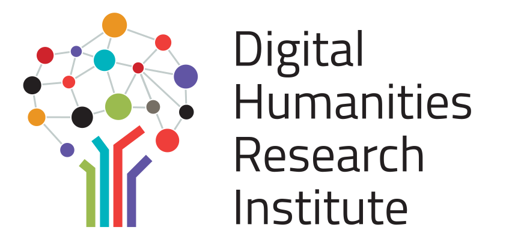

# **Digital Scholarship Research Institute 2021**

The Trico Libraries Digital Scholarship Group is pleased to announce the 2021 Trico Digital Scholarship Research Institute (DSRI), a program of two half-days of online workshops, discussions, and project showcases that explore interdisciplinary digital scholarship research and teaching methods. We welcome Trico faculty and staff new to digital scholarship as well as those interested in taking their existing skills to the next level. 

During this year’s institute we will explore how (and why) to use the command line, getting digital publishing and exhibits on the web, scraping usable data from websites, and getting started with messy data in the humanities and social sciences.

We will also discuss project support and grant opportunities in the Trico and beyond, crafting potential projects and digital assignments, and finding our way through the maze of possible tools, services, and platforms.

The Digital Scholarship Research Institute will be hosted through Zoom at 12:30pm on two consecutive Friday afternoons, June 4 and 11.

Please register by **Friday, May 21st**. We look forward to seeing you this summer! 😎

<button role="button" class="button-blue" aria-label="open submit proposal form">
    <a href="https://forms.gle/XMzKZtCFJpSPGqeF7">Click here to register</a>
</button>

### [Find out more about 2019's insitute here.](2019)

*The DSRI is sponsored by Bryn Mawr College’s LITS, Haverford College Libraries, and Swarthmore Libraries. The Tri-Co DSRI was developed as part of the NEH-sponsored [Digital Humanities Research Institute](http://dhinstitutes.org/) hosted at the CUNY Grad Center in June 2018.*

{: .logos}

---

## Course Instructors





<strong>{{ contributor[1].name }}</strong>
{{ contributor[1].bio }}



